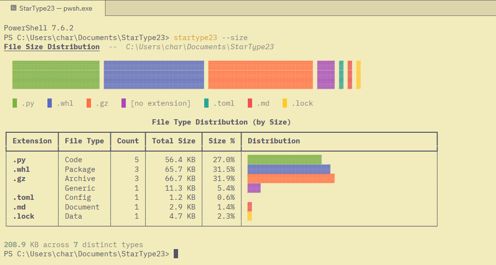

# StarType23



A CLI tool that walks a directory, counts files by extension, and renders a
colourful file-type distribution chart in the terminal.

## Features

- Scans recursively and groups files by extension (count and disk size).
- Renders a stacked proportion bar + a table with coloured mini bars.
- Two modes: by **count** (`startype23`) or by **size** (`startype23 --size`).
- Built-in lookup table of ~500 extensions with file-type category and
  one-line description (`--explain .py`).
- Column visibility toggles: `--filetype`, `--count`, `--percentage`,
  `--distribution`.
- Skips `.git`, `.venv`, `node_modules`, `__pycache__`, and similar by
  default.
- Flat-design pastel colour palette (no neon).

## Installation

```bash
uv tool install startype23
# or via pip:
pip install startype23
```

After installation, both `startype23` and `st23` are available globally.

## Usage

```
startype23 (or st23)                    scan current directory
startype23 --size                       scan by disk size
startype23 --path /some/dir             scan a specific directory
startype23 --include-hidden             include dotfiles
startype23 --explain .py                look up an extension
startype23 --explain py                 leading dot is optional
startype23 --exclude build              skip extra directories
startype23 --count --percentage         show only selected columns
```

| Flag                       | Description                                   |
|----------------------------|-----------------------------------------------|
| `--path`                   | Directory to scan (default: `.`)              |
| `--exclude` / `-x`         | Extra directory names to skip (repeatable)    |
| `--include-hidden`         | Include dotfiles in the scan                  |
| `--no-include-hidden`      | Exclude dotfiles (default)                    |
| `--explain` / `-e`         | Look up an extension and show its description |
| `--size` / `-s`            | Size distribution instead of count            |
| `--filetype` / `-ft`       | Show the File Type column                     |
| `--count` / `-c`           | Show the Count column                         |
| `--percentage` / `-p`      | Show the Percentage column                    |
| `--distribution` / `-d`    | Show the Distribution bar column              |

When no column flags are given, all columns show.  When one or more are
given, only those (plus Extension) are shown.

## Tools used to build this project

- **Python 3.10+** -- language runtime.
- **uv** -- package and project manager (install, build, publish).
- **click** -- CLI framework (arguments, options, help).
- **rich** -- terminal styling (tables, colours, text formatting).
- **hatchling** -- build backend (PEP 517).
- **Wikipedia's List of filename extensions** -- source for the ~500-entry
  extension lookup table.

